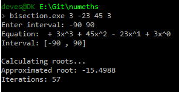
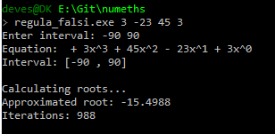
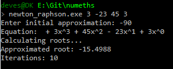

# Assignment - Root Finding Methods
#### Devesh Khandelwal (72576)
###### *V.1 - Algorithms for Computational Mathematics: Numerical Methods*
###### *B. Tech. (Information Technology and Mathematical Innovations)*
###### *Cluster Innovation Centre, University of Delhi*

## Bisection Method

    /**
     - Program to find root of a polynomial using Bisection method.
     *
     - @author Devesh Khandelwal
     - @created 21-08-2015
     - @modified 27-08-2015
     */

    #include <iostream>
    #include <cmath>
    #include <string>
    #include <vector>

    // Error tolerance of polynomial.
    #define EPSILON 0.000000000001

    using namespace std;

    // Number of iterations.
    long iterations = 0;

    /**
     - Calculates the polynomial value.
     - 
     - @param  coefficients Array of coefficients
     - @param  size         Order of equation
     - @param  x            Value to calculate, independent variable
     - @return              Polynomial value, dependent variable
     */
    double polynomial(double *coefficients, int size, double x)
    {
        double sum=0;
        for (int i = 0; i < size; ++i)
        {
            sum += coefficients[i]*pow(x, i);
        }
        return sum;
    }

    /**
     - Find root in a given interval.
     - 
     - @param  coefficients Array of coefficients
     - @param  size         Order of equation
     - @param  a            Interval start
     - @param  b            Interval end
     - @return              Root of polynomial, if found
     */
    double bisection(double *coefficients, int size, double a, double b)
    {
        if (abs(polynomial(coefficients, size, (a+b)/2))<EPSILON)
        {
            return (a+b)/2;
        }
        else
        {
            if (polynomial(coefficients, size, (a+b)/2)*
                polynomial(coefficients, size, a) < 0)
                bisection(coefficients, size, a, (a+b)/2);
            else
                bisection(coefficients, size, (a+b)/2, b);
        }
    }

    /**
     - main function. Takes coefficients of a polynomial equation
     - as command line arguments in increasinig polynomial degree.
     - 
     - @param  argc Number of arguments
     - @param  argv Arguments
     - @return      Status code.
     */
    int main(int argc, char const *argv[])
    {

        string degree;                      // No of coefficients not used.
        float a, b;
        vector<string> arguments;
        double *coefficients;
        coefficients = new double[argc-1];

        // Taking coefficientsfrom command line argument into double array.
        if (argc > 1)
        {
            degree = argv[1];   // Not used.
            arguments.assign(argv + 1, argv + argc);
        }
        for(int i=0; i<arguments.size() ;i++)
        {
            coefficients[i] = stod(arguments[i], 0);
        }

        // Taking the interval limits.
        cout<<"Enter interval: ";
        cin>>a>>b;

        // Displaying equation.
        cout<<"Equation: ";
        for(int i=0; i<arguments.size() ; i++)
            cout<<((coefficients[arguments.size()-1-i]>0)?" + ":" - ")
                <<abs(coefficients[arguments.size()-1-i])<<"x^"
                <<arguments.size()-1-i;

        cout<<"\nInterval: ["<<a<<" , "<<b<<"]"<<endl;

        if (polynomial(coefficients, arguments.size(), a)*
            polynomial(coefficients, arguments.size(), b) > 0)
        {
            cerr<<"Interval does not contain any root!!!"<<endl<<"Aborting...";
            return 1;
        }
        else
        {
            cout<<endl;
            cout<<"Calculating roots..."<<endl;
            cout<<"Approximated root: "
                <<bisection(coefficients, arguments.size(), a, b)<<endl;
            cout<<"Iterations: "<<iterations<<endl;
            return 0;
        }
    }

#### Output

## Regula Falsi Method

    /**
     - Program to find root of a polynomial using Regula Falsi (False Position) method.
     *
     - @author Devesh Khandelwal
     - @created 27-08-2015
     - @modified 27-08-2015
     */

    #include <iostream>
    #include <iomanip>
    #include <cmath>
    #include <string>
    #include <vector>

    // Error tolerance of polynomial.
    #define EPSILON 9.16978e-005`

    using namespace std;

    // Number of iterations.
    long iterations = 0;

    // Last two iterations.
    double pn = 0, pn1 = 0, pn2 = 0, error = 0;

    /**
     - Calculates the polynomial value.
     - 
     - @param  coefficients Array of coefficients
     - @param  size         Order of equation
     - @param  x            Value to calculate, independent variable
     - @return              Polynomial value, dependent variable
     */
    double polynomial(double *coefficients, int size, double x)
    {
        double sum=0;
        for (int i = 0; i < size; ++i)
        {
            sum += coefficients[i]*pow(x, i);
        }
        return sum;
    }

    /**
     - Calcuates the approximated root in the given interval.
     - 
     - @param  a Interval start point
     - @param  b Interval end point
     - @return   x-intercept value of the secant in the given interval
     */
    double x_intercept(double a, double b, double f_a, double f_b)
    {
        return b - (f_b*((b-a)/(f_b-f_a)));
    }

    void calculate_error()
    {
        // Check if 
        if (++iterations > 3)
        {
            error = (pn - pn1) / (pn1 - pn2);
            error = (abs(error)/abs(error-1))*abs(pn-pn1);
        }
    }

    /**
     - Find root in a given interval.
     - 
     - @param  coefficients Array of coefficients
     - @param  size         Order of equation
     - @param  a            Interval start
     - @param  b            Interval end
     - @return              Root of polynomial, if found
     */
    double falsi(double *coefficients, int size, double a, double b)
    {
        iterations++;

        calculate_error();

        pn2 = pn1;
        pn1 = pn;
        pn = x_intercept(a, b, polynomial(coefficients, size, a),
                polynomial(coefficients, size, b));

        if (abs(polynomial(coefficients, size,
            x_intercept(a, b, polynomial(coefficients, size, a),
            polynomial(coefficients, size, b))))<EPSILON)
        {
            return x_intercept(a, b, polynomial(coefficients, size, a),
            polynomial(coefficients, size, b));
        }
        else
        {
            if (polynomial(coefficients, size, x_intercept(a, b,
                polynomial(coefficients, size, a),
                polynomial(coefficients, size, b)))*
                polynomial(coefficients, size, a) < 0)
                falsi(coefficients, size, a, x_intercept(a, b,
                        polynomial(coefficients, size, a),
                        polynomial(coefficients, size, b)));
            else
                falsi(coefficients, size, x_intercept(a, b,
                        polynomial(coefficients, size, a),
                        polynomial(coefficients, size, b)), b);
        }
    }

    /**
     - main function. Takes coefficients of a polynomial equation
     - as command line arguments in increasinig polynomial degree.
     - @param  argc Number of arguments
     - @param  argv Arguments
     - @return      Status code.
     */
    int main(int argc, char const *argv[])
    {

        string degree;                      // No of coefficients not used.
        float a, b;
        vector<string> arguments;
        double *coefficients;
        coefficients = new double[argc-1];

        // Taking coefficients from command line argument into double array.
        if (argc > 1)
        {
            degree = argv[1];   // Not used.
            arguments.assign(argv + 1, argv + argc);
        }
        for(int i=0; i<arguments.size() ;i++)
        {
            coefficients[i] = stod(arguments[i], 0);
        }

        // Taking the interval limits.
        cout<<"Enter interval: ";
        cin>>a>>b;

        // Displaying equation.
        cout<<"Equation: ";
        for(int i=0; i<arguments.size() ; i++)
            cout<<((coefficients[arguments.size()-1-i]>0)?" + ":" - ")
                <<abs(coefficients[arguments.size()-1-i])
                <<"x^"<<arguments.size()-1-i;

        cout<<"\nInterval: ["<<a<<" , "<<b<<"]"<<endl;

        if (polynomial(coefficients, arguments.size(), a)*
            polynomial(coefficients, arguments.size(), b) > 0)
        {
            cerr<<"Interval does not contain any root!!!"<<endl<<"Aborting...";
            return 1;
        }
        else
        {
            cout<<endl;
            cout<<"Calculating roots..."<<endl;
            cout<<"Approximated root: "
                <<falsi(coefficients, arguments.size(), a, b)<<endl;
            cout<<"Iterations: "<<iterations<<endl;
            return 0;
        }
    }

#### Output

## Newton-Raphson Method

    /**
     + Program to find root of a polynomial using Newton-Raphson method.
     *
     + @author Devesh Khandelwal
     + @created 04-09-2015
     + @modified 04-09-2015
     */

    #include <iostream>
    #include <iomanip>
    #include <cmath>
    #include <string>
    #include <vector>

    // Error tolerance of polynomial.
    #define EPSILON 9.16978e-005

    using namespace std;

    // Number of iterations.
    long iterations = 0;

    // Last two iterations.
    double pn = 0, pn1 = 0, pn2 = 0, error = 0;

    /**
     + Calculates the polynomial value.
     + 
     + @param  coefficients Array of coefficients
     + @param  size         Order of equation
     + @param  x            Value to calculate, independent variable
     + @return              Polynomial value, dependent variable
     */
    double polynomial(double *coefficients, int size, double x)
    {
        double sum=0;
        for (int i = 0; i < size; ++i)
        {
            sum += coefficients[i]*pow(x, i);
        }
        return sum;
    }

    /**
     + Calculates the derivative of the polynomial.
     + 
     + @param  coefficients Array of coefficients
     + @param  size         Order of equation
     + @param  x            Value to calculate, independent variable
     + @return              Polynomial's derivative value, dependent variable
     */
    double derivative(double *coefficients, int size, double x)
    {
        double sum=0;
        for (int i = 1; i < size; ++i)
        {
            sum += coefficients[i]*i*pow(x,i-1);
        }
        return sum;
    }

    /**
     + Find root using an initial approximation.
     + 
     + @param  coefficients Array of coefficients
     + @param  size         Order of equation
     + @param  x            Initial approximation
     + @return              Approximated root
     */
    double newton_raphson(double *coefficients, int size, double x)
    {
        iterations++;
        if (abs(polynomial(coefficients, size, x))<EPSILON)
        {
            return x;
        }
        else
            return newton_raphson(coefficients, size,
                    x - polynomial(coefficients, size, x)
                    /derivative(coefficients, size, x));
    }

    /**
     + main function. Takes coefficients of a polynomial equation
     + as command line arguments in increasinig polynomial degree.
     + @param  argc Number of arguments
     + @param  argv Arguments
     + @return      Status code.
     */
    int main(int argc, char const *argv[])
    {

        string degree;                      // No of coefficients not used.
        float x;
        vector<string> arguments;
        double *coefficients;
        coefficients = new double[argc-1];

        // Taking coefficientsfrom command line argument into double array.
        if (argc > 1)
        {
            degree = argv[1];   // Not used.
            arguments.assign(argv + 1, argv + argc);
        }
        for(int i=0; i<arguments.size() ;i++)
        {
            coefficients[i] = stod(arguments[i], 0);
        }

        // Taking the interval limits.
        cout<<"Enter initial approximation: ";
        cin>>x;

        // Displaying equation.
        cout<<"Equation: ";
        for(int i=0; i<arguments.size() ; i++)
            cout<<((coefficients[arguments.size()-1-i]>0)?" + ":" - ")
                <<abs(coefficients[arguments.size()-1-i])
                <<"x^"<<arguments.size()-1-i;

        {
            cout<<endl;
            cout<<"Calculating roots..."<<endl;
            cout<<"Approximated root: "
                <<newton_raphson(coefficients, arguments.size(), x)<<endl;
            cout<<"Iterations: "<<iterations<<endl;
            return 0;
        }
    }

#### Output

## Secant Method

    /**
     - Program to find root of a polynomial using Bisection method.
     *
     - @author Devesh Khandelwal
     - @created 28-09-2015
     - @modified 28-09-2015
     */

    #include <iostream>
    #include <cmath>
    #include <string>
    #include <vector>

    // Error tolerance of polynomial.
    #define EPSILON 0.000000000001

    using namespace std;

    // Number of iterations.
    long iterations = 0;

    /**
     - Calculates the polynomial value.
     - 
     - @param  coefficients Array of coefficients
     - @param  size         Order of equation
     - @param  x            Value to calculate, independent variable
     - @return              Polynomial value, dependent variable
     */
    double polynomial(double *coefficients, int size, double x)
    {
        double sum=0;
        for (int i = 0; i < size; ++i)
        {
            sum += coefficients[i]*pow(x, i);
        }
        return sum;
    }

    /**
     - Find root in a given interval.
     - 
     - @param  coefficients Array of coefficients
     - @param  size         Order of equation
     - @param  a            Interval start
     - @param  b            Interval end
     - @return              Root of polynomial, if found
     */
    double secant(double *coefficients, int size, double x0, double x1)
    {
        iterations++;
        if (abs(polynomial(coefficients, size, x1))<EPSILON)
        {
            return x1;
        }
        else
        {
            return secant(coefficients, size, x1,
                    x1 - (polynomial(coefficients, size, x1)*(x1-x0))/
                    (polynomial(coefficients, size, x1)-
                    polynomial(coefficients, size, x0)));
        }
    }

    /**
     - main function. Takes coefficients of a polynomial equation
     - as command line arguments in increasinig polynomial degree.
     - @param  argc Number of arguments
     - @param  argv Arguments
     - @return      Status code.
     */
    int main(int argc, char const *argv[])
    {

        string degree;                      // No of coefficients not used.
        double x0, x1;
        vector<string> arguments;
        double *coefficients;
        coefficients = new double[argc-1];

        // Taking coefficientsfrom command line argument into double array.
        if (argc > 1)
        {
            degree = argv[1];   // Not used.
            arguments.assign(argv + 1, argv + argc);
        }
        for(int i=0; i<arguments.size() ;i++)
        {
            coefficients[i] = stod(arguments[i], 0);
        }

        // Taking the interval limits.
        cout<<"Enter x0 and x1: ";
        cin>>x0>>x1;

        // Displaying equation.
        cout<<"Equation: ";
        for(int i=0; i<arguments.size() ; i++)
            cout<<((coefficients[arguments.size()-1-i]>0)?" + ":" - ")
                <<abs(coefficients[arguments.size()-1-i])
                <<"x^"<<arguments.size()-1-i;

        {
            cout<<endl;
            cout<<"Calculating roots..."<<endl;
            cout<<"Approximated root: "
                <<secant(coefficients, arguments.size(), x0, x1)<<endl;
            cout<<"Iterations: "<<iterations<<endl;
            return 0;
        }
    }

#### Output

**THE END.** *Namaste.*
